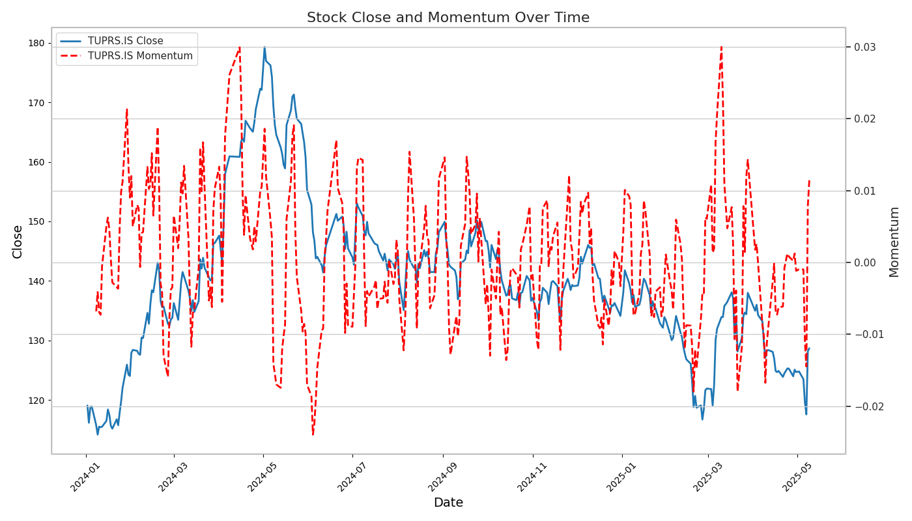

# Stock Momentum Analysis

This script, `run.py`, fetches historical stock data for specified tickers, calculates their momentum, and plots both the closing prices and momentum over time. The resulting chart is saved as an image file.

## Features

-   Fetches historical stock closing prices using the `yfinance` library.
-   Calculates momentum based on a rolling window of percentage changes.
-   Generates a combined plot showing:
    -   Stock closing prices over time.
    -   Calculated momentum over time (on a secondary y-axis).
-   Saves the generated plot to the `img/` directory. The filename includes the ticker symbols (e.g., `img/stock_momentum_chart_TUPRS_IS.png`).

## How to Run

1.  **Ensure Dependencies are Installed:**
    Make sure you have Python installed and the necessary libraries listed in `requirements.txt`. You can install them using pip:
    ```bash
    pip install -r requirements.txt
    ```

2.  **Modify Tickers (Optional):**
    Open `run.py` and modify the `tickers` list and `start_date` variable in the `if __name__ == "__main__":` block if you want to analyze different stocks or a different time period.
    ```python
    if __name__ == "__main__":
        tickers = ["TUPRS"]  # Add or change tickers here, e.g., ["AAPL", "MSFT"]
        tickers_mapped = [f"{ticker}.IS" for ticker in tickers] # Adjust mapping if needed (e.g. for non-Istanbul stock exchange tickers)
        start_date = "2024-01-01"  # Change start date if needed

        stock_momentum = StockMomentum(tickers_mapped, start_date)
        stock_momentum.main()
    ```

3.  **Execute the Script:**
    Run the script from your terminal:
    ```bash
    python run.py
    ```

## Output

The script will:
-   Print the path to the saved plot image in the console (e.g., `Plot saved to img/stock_momentum_chart_TUPRS_IS.png`).
-   Save the chart image in the `img/` directory.

### Example Plot

Below is an example of what the generated chart might look like.

(Assuming the script was run with `TUPRS.IS` as the ticker)



*Note: You will need to run the script first to generate the image for it to be displayed here.*
